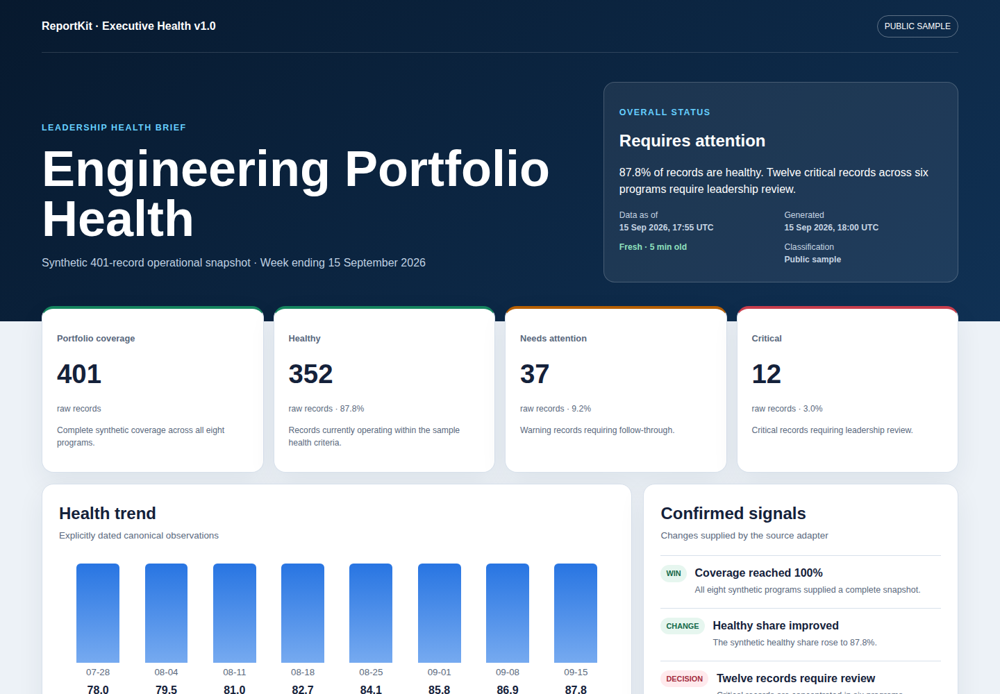
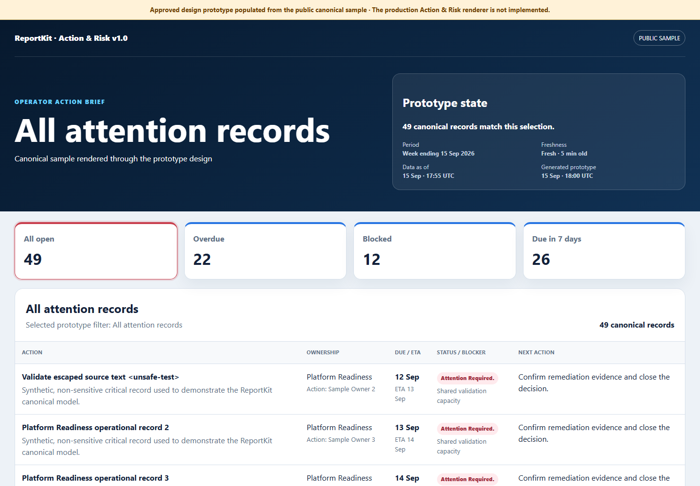
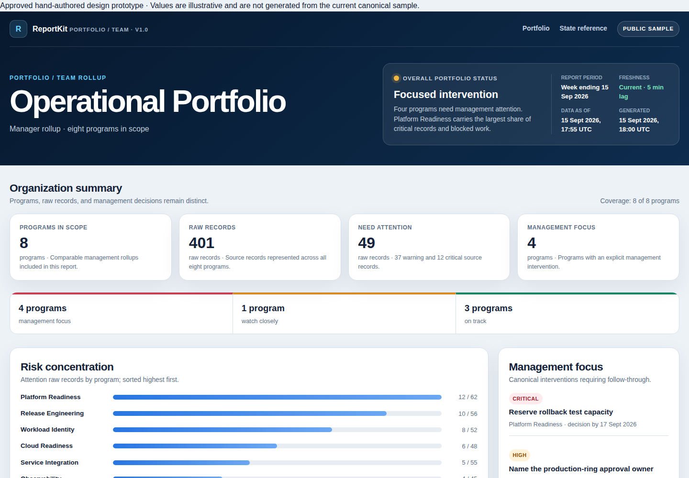
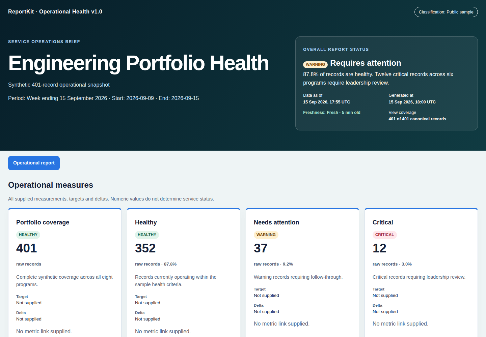
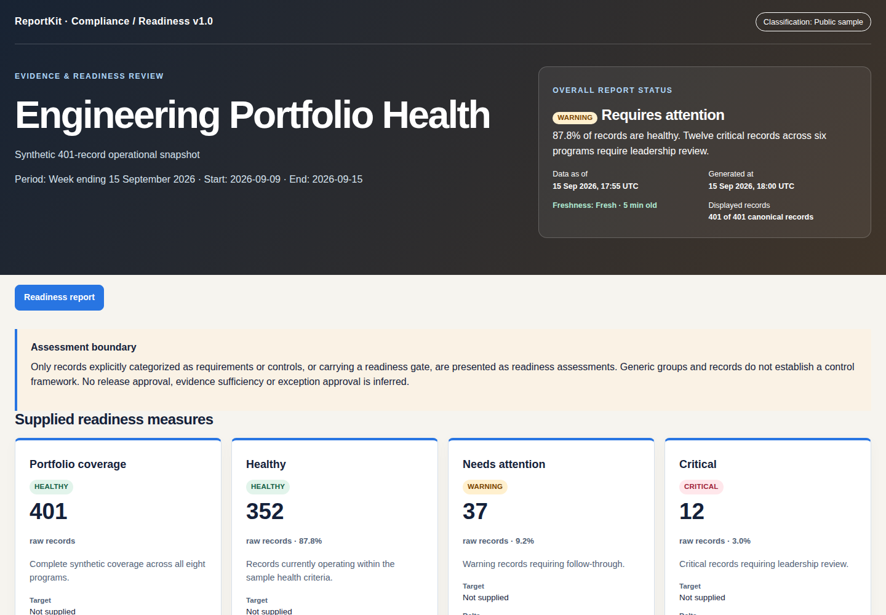
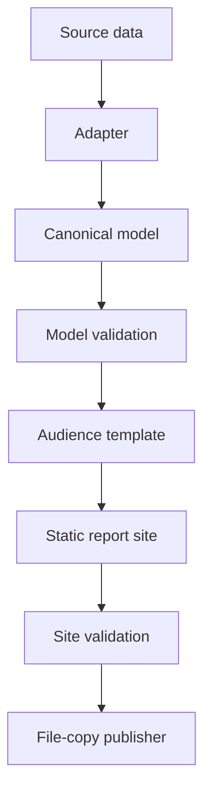

# Microsoft ReportKit

> **Project status and disclaimer:** ReportKit is an experimental open-source Hack Week project. It is not an official Microsoft product or service and is not covered by Microsoft commercial support, service-level agreements, or product lifecycle commitments. Its interfaces, templates, and behavior may change without notice. Evaluate security, privacy, accessibility, compliance, and operational requirements before using it in production. Public examples must contain synthetic data only.

> From operational data to a durable report—without building another dashboard.

ReportKit is an open-source, static-first reporting skill that helps an AI agent transform structured operational data into polished, validated, audience-specific HTML report sites.

It is designed for teams whose reporting is trapped in recurring email, presentations, spreadsheets, screenshots, or source-specific dashboards. ReportKit converts a point-in-time data snapshot into a portable report that can be reviewed, archived, compared, and published almost anywhere.

ReportKit is **a skill and reporting contract**, not a hosted service and not a package that users must deploy. The repository contains the skill instructions, canonical data contract, reusable report templates, validation rules, examples, and supporting generation scripts.

> **Experimental status:** ReportKit is an open-source Hack Week project with all five built-in
> renderers and a single-page declarative custom-template foundation. Validation remains a baseline,
> not production certification. Publishing, a generic CSV adapter, executable guided init/resume,
> and Pages deployment are not implemented.



| Five generated reports | Static-first | Deterministic validation |
|---|---|---|
| Five built-in renderers use the same public canonical snapshot. | Core content and navigation work without a backend or required JavaScript. | Explicit inputs produce stable output with model and site validation. |

## One canonical source, five generated reports

| Leadership | Operations |
|---|---|
| [](examples/operational-snapshot/generated/executive-health/index.html) | [](examples/operational-snapshot/generated/action-risk/index.html) |
| **Are we healthy?** | **What must happen next?** |

| Management | Reliability | Assurance |
|---|---|---|
| [](examples/operational-snapshot/generated/portfolio-team/index.html) | [](examples/operational-snapshot/generated/operational-health/index.html) | [](examples/operational-snapshot/generated/compliance-readiness/index.html) |
| **Where is risk concentrated?** | **What regressed?** | **Can we proceed?** |

[Archived 36-second design walkthrough](docs/assets/reportkit-walkthrough.mp4) ·
[View the architecture diagram](docs/assets/reportkit-architecture.svg) ·
[Open the local showcase](showcase/index.html)

GitHub displays checked-in `.html` links as source, not a browser preview. Clone or download the
repository and open `showcase/index.html` locally to review the rendered pages. GitHub Pages is
not configured or deployed.

The archived video predates completion of the additional renderers. Use the generated reports
and refreshed screenshots for current implementation review.

## 60-second quick start

Run these commands from the repository root, or from the installed skill root after following
[skill installation](#1-make-the-skill-available). Python 3.10 or later is required.

```powershell
python scripts\validate `
  examples\operational-snapshot\canonical-report.json `
  --kind model `
  --template executive-health

python scripts\build `
  --template executive-health `
  --data examples\operational-snapshot\canonical-report.json `
  --config examples\operational-snapshot\executive-health.config.json `
  --output report-site

python scripts\validate report-site --kind site
```

Open `report-site\index.html`. No server or package installation is required.

### Choose any built-in renderer

Use one of these `--template` IDs with the same
`examples\operational-snapshot\canonical-report.json` and the matching configuration:

| Template ID | Sample configuration | Generated example (HTML source on GitHub) |
|---|---|---|
| `executive-health` | `executive-health.config.json` | [Executive Health](examples/operational-snapshot/generated/executive-health/index.html) |
| `action-risk` | `action-risk.config.json` | [Action & Risk](examples/operational-snapshot/generated/action-risk/index.html) |
| `portfolio-team` | `portfolio-team.config.json` | [Portfolio / Team](examples/operational-snapshot/generated/portfolio-team/index.html) |
| `operational-health` | `operational-health.config.json` | [Operational Health](examples/operational-snapshot/generated/operational-health/index.html) |
| `compliance-readiness` | `compliance-readiness.config.json` | [Compliance / Readiness](examples/operational-snapshot/generated/compliance-readiness/index.html) |

Configuration files are under `examples\operational-snapshot`. Change both `--template` and
`--config` in the quick start; use a fresh output directory for each report. Existing ReportKit
output requires explicit replacement approval and `--overwrite`; never replace an unrelated folder.

To regenerate all checked-in public examples after explicitly approving replacement of their
ReportKit-owned output folders:

```powershell
python -B scripts\build-examples --overwrite
```

This uses the same canonical source and the checked-in per-template configurations. All five
built-ins require the `report` section; absent or empty optional arrays produce honest empty states.
Invalid group cycles are rejected rather than recursively rendered.

Action & Risk provides real static **All attention**, **Overdue**, **Blocked**, and **Due in seven
days** views, plus **All records**. All attention selects `warning`, `critical`, `blocked`, `failed`,
`in-progress`, `pending-review`, or `not-started` status, or an explicit nonblank blocker—not an
invented open/closed lifecycle. Date queues use the UTC date of explicit `generatedAt`: overdue
is strictly earlier, and due in seven days includes today through today + 7. Healthy/passed/
complete/not-applicable records are excluded from date queues unless they have an explicit blocker.
Queues overlap and are not additive.

Portfolio / Team generates a detail page for every canonical group. Membership includes explicit
group/item references and descendants, deduplicated per group; overlapping groups are not additive.
Missing source concepts remain explicit rather than becoming invented health or readiness facts.

The current self-contained policy rejects external hyperlinks as well as external assets.
Source/evidence HTTP(S) references are displayed as escaped text, not clickable external links;
only generated report navigation is clickable. Unsupported destinations remain unavailable.

All five examples preserve the same 401 source-record units. Operational Health and Compliance /
Readiness organize available canonical facts; they do not fabricate service availability, control
pass rates, exceptions, or approval decisions when the source does not provide them.

### Bring your own declarative template

```powershell
python scripts\validate-template `
  examples\custom-template-project\templates\contoso-release-review

python scripts\build-template `
  --template examples\custom-template-project\templates\contoso-release-review `
  --data examples\custom-template-project\templates\contoso-release-review\examples\canonical-report.json `
  --config examples\custom-template-project\templates\contoso-release-review\examples\configuration.json `
  --lock examples\custom-template-project\reportkit.lock.json `
  --output custom-report-site
```

Declarative packs compose approved ReportKit components without executable HTML, CSS, JavaScript,
or renderer code. Their immutable SHA-256 identity is recorded in project state, the lock file, and
the generated manifest. Text-file line endings are normalized before digesting so the same pack
retains its identity across Windows and Linux checkouts.

Custom configuration schemas use a bounded, restricted JSON Schema subset—not universal
conformance. See [schema and pattern limits](docs/custom-templates-guided-build.md#configuration-schema-limits).

### Build the Excel-driven Product GA Readiness report

The included [`examples/product-ga-readiness`](examples/product-ga-readiness) project adds a
single-page management report for GA decisions. Its governed Excel workbook owns the report facts,
including identity, gates, milestones, decisions, adoption, owners, dates, evidence, and actions.

```powershell
python examples\product-ga-readiness\scripts\excel-to-reportkit.py `
  --input examples\product-ga-readiness\Product-GA-Readiness-Input.xlsx `
  --out-dir examples\product-ga-readiness

python scripts\build-template `
  --template examples\product-ga-readiness\templates\microsoft-product-ga-readiness `
  --data examples\product-ga-readiness\canonical-report.json `
  --config examples\product-ga-readiness\product-ga-readiness.config.json `
  --lock examples\product-ga-readiness\reportkit.lock.json `
  --output examples\product-ga-readiness\generated-site `
  --overwrite
```

Open `examples\product-ga-readiness\generated-site\index.html`. To change the report, update the
workbook and rerun the adapter and build; do not hand-edit generated JSON or HTML.

## Why ReportKit?

Teams often already have the facts they need. The difficulty is turning those facts into a report that is:

- Appropriate for a particular audience
- Clear about freshness and reporting period
- Consistent about status, ownership, dates, and units
- Inspectable before sharing, with validation results and explicit review
- Useful without a backend
- Easy to archive as a point-in-time record
- Portable across SharePoint, file shares, artifacts, storage, and static hosting

A dashboard is not always the right answer. Dashboards require hosting, permissions, runtime dependencies, maintenance, and continued access to the source system. Email reports are easy to send but difficult to navigate, reuse, compare, and retain.

ReportKit produces a durable middle ground: a validated static report site.

## Product boundary

ReportKit follows one architectural rule:

> **The source determines the facts.**  
> **The template determines how those facts are communicated.**  
> **The destination determines where the generated report lives.**

This means:

- Adapters transform source data into canonical ReportKit data.
- Templates communicate canonical facts for a specific audience.
- Publishers copy validated output to a destination.
- Adapters do not contain presentation logic.
- Templates do not understand source-specific schemas.
- Publishers do not transform report facts.

## Static-first is a feature

Every ReportKit template is designed to produce useful output without JavaScript.

Static output provides:

- No backend or database dependency
- Inexpensive and flexible hosting
- Point-in-time archival
- Easy file-based distribution
- Compatibility with restrictive hosting environments
- Predictable security boundaries
- Simple link and content validation
- Long-term readability after the source system changes

Optional progressive enhancement may be added later, but core report content and navigation must remain available without it.

## Who is ReportKit for?

ReportKit is useful for:

- Engineering and operations teams
- Program and portfolio managers
- Release and readiness reviewers
- Security and compliance teams
- Leadership reporting
- Incident and reliability reviews
- Teams publishing reports to SharePoint or file-based portals
- AI agents that need a governed way to create operational reports

ReportKit is source-neutral. Azure DevOps, GitHub, CSV, JSON, service-health systems, security platforms, spreadsheets, and internal APIs can all be inputs when an adapter maps them into the canonical model.

## The five templates

ReportKit implements five experimental built-in reporting templates. Templates are selected by the
decision the reader needs to make, not by the source system that supplied the data. The content
below describes audience needs; a renderer can show only facts supplied by the canonical model.

| Template | Primary audience | Primary decision | Typical content |
|---|---|---|---|
| **Executive Health** | Executives and senior leaders | Are we healthy, and where does leadership need to intervene? | Overall status, KPIs, trends, highlights, decisions, concentration, and outlook |
| **Action & Risk Tracker** | Operators and delivery teams | What needs to be fixed, by whom, and by when? | Prioritized actions, accountable owner, action owner, due date, ETA, blockers, aging, and next action |
| **Portfolio / Team Rollup** | Managers and organization leaders | Which teams carry the most risk, and where should management intervene? | Organization summary, comparable team metrics, risk concentration, team cards, and linked team-detail pages |
| **Operational Health** | Service owners and release managers | What is degraded, what threatens reliability or delivery, and what must recover next? | Availability, builds, deployments, incidents, regressions, blockers, service health, and recovery milestones |
| **Compliance / Readiness** | Assurance leaders and approvers | Can the review or release proceed, and which requirements or exceptions remain? | Controls, evidence, gates, exceptions, readiness status, owners, remediation, and expiry dates |

### Choosing a template

Use the reader’s question as the selector:

- “Do leaders need to intervene?” → **Executive Health**
- “What exactly must we do next?” → **Action & Risk Tracker**
- “Which teams are carrying the risk?” → **Portfolio / Team Rollup**
- “What is broken or degrading operationally?” → **Operational Health**
- “Are the requirements satisfied so we can proceed?” → **Compliance / Readiness**

The same canonical snapshot can be rendered through multiple templates. The facts remain the same while the decision surface changes.

## How it works



This diagram includes the planned publisher; current execution ends with validated local files.
The adapter box is a design boundary: source JSON/CSV mapping currently remains manual and
agent-assisted, not an executable generic connector.

The layers have intentionally narrow responsibilities:

| Layer | Knows about | Must not do |
|---|---|---|
| Source adapter | Source schema and canonical schema | Render HTML or publish files |
| Canonical model | Reporting facts and semantics | Encode source-specific presentation |
| Validator | Schemas, references, safety, and consistency | Silently repair or invent facts |
| Template | Audience and report composition | Query source systems or change facts |
| Site generator | Deterministic rendering and file creation | Read the current clock or network |
| Publisher | Validated files and destination | Transform report data or publish partial output |

## Using ReportKit as an agent skill

ReportKit is intended to be used by an agent that can read the repository’s `SKILL.md` and work with local files.

### 1. Make the skill available

For GitHub Copilot CLI, install the **entire repository** in a lowercase `reportkit` skill
directory. Do not copy `SKILL.md` alone: it depends on the adjacent `scripts/`, `schema/`,
`docs/`, `agents/`, `templates/`, and `examples/` directories. This is folder-based skill
installation, not a language-package installation.

Choose **one** of the following PowerShell alternatives. Do not install both copies for the same
session. Both examples refuse to replace an existing folder; inspect and deliberately update an
existing installation instead of blindly overwriting it.

**Project skill:** start at the root of the project where you want to use ReportKit:

```powershell
$skillRoot = Join-Path (Get-Location) '.github\skills\reportkit'
if (Test-Path -LiteralPath $skillRoot) { throw 'Skill folder already exists; inspect it before updating.' }
New-Item -ItemType Directory -Force -Path (Split-Path $skillRoot) | Out-Null
git clone https://github.com/microsoft/ReportKit.git "$skillRoot"
if ($LASTEXITCODE -ne 0) { throw 'Clone failed.' }
```

**Personal skill:** available across projects in your home directory:

```powershell
$skillRoot = Join-Path $HOME '.copilot\skills\reportkit'
if (Test-Path -LiteralPath $skillRoot) { throw 'Skill folder already exists; inspect it before updating.' }
New-Item -ItemType Directory -Force -Path (Split-Path $skillRoot) | Out-Null
git clone https://github.com/microsoft/ReportKit.git "$skillRoot"
if ($LASTEXITCODE -ne 0) { throw 'Clone failed.' }
```

A downloaded repository works too: place its complete contents directly inside the chosen
`reportkit` folder, with `reportkit\SKILL.md` at the top level, not an extra nested repository folder.
Keep the installation's nested Git metadata out of the host project's commits.

Start `copilot` from the **host project's root** for project-skill discovery, not from the nested
cloned skill repository. Personal skills are available across projects. Inside that interactive
Copilot CLI session, verify discovery and explicitly invoke the skill:

```text
/skills reload
/skills info reportkit
Use the /reportkit skill.
```

The first two lines are CLI commands; the last is a prompt using GitHub's documented skill-name
syntax. Confirm that `info` reports the intended installation. An unqualified start displays
exactly three numbered choices and stops:

1. Start a new report
2. Inspect an existing ReportKit project and continue manually
3. Validate a custom template

Choice 2 does not automate resume or follow project-file references; choice 3 validates a local
folder/ZIP and does not install it. Source JSON/CSV mapping remains manual and agent-assisted.
Run all relative build/validation commands from the **installed skill root**, not the host project.
Resolve explicitly approved data/output paths before switching directories.

In the shell running the helper commands, set the working directory to the chosen installation
first (use the `$skillRoot` value from the installation example; re-establish it in a new shell):

```powershell
Set-Location -LiteralPath $skillRoot
```

Official guidance: [Adding agent skills for GitHub Copilot CLI](https://docs.github.com/en/copilot/how-tos/copilot-cli/customize-copilot/add-skills)
and [About agent skills](https://docs.github.com/en/copilot/concepts/agents/about-agent-skills).

## Repository status at a glance

ReportKit is an early open-source Hack Week project with five built-in renderers and generated
examples from one canonical source. Completion of those renderers does not close every v1 release gate.

| Capability | Current state |
|---|---|
| Skill-guided workflow | Available in `SKILL.md` |
| Canonical schema 1.0 | Available |
| Configuration, capability, manifest, and validation schemas | Available |
| Executive Health deterministic generation | Implemented |
| Built-in model and generated-site validation | Implemented baseline |
| Action & Risk generation and static filters | Implemented |
| Portfolio / Team generation and all-group detail pages | Implemented |
| Operational Health generation | Implemented from canonical facts |
| Compliance / Readiness generation | Implemented from canonical facts |
| Declarative custom templates | Locked, single-page foundation |
| Synthetic 401-record sample | Available |
| Safe file-copy publisher | Not implemented yet |
| Generic CSV adapter / executable mapping engine | Not implemented; manual agent-assisted mapping only |
| Executable guided init/resume | Not implemented; project-state examples only |
| GitHub Pages deployment | Not implemented or deployed |
| Published language package | Intentionally not part of the product |

Legacy prototype pages remain archived design references, not built-in renderer output. The Action
& Risk interaction prototype is canonical-populated; other archived values are illustrative.

## Prerequisites

The current helper scripts require Python 3.10 or later and use only the Python standard library. There is no package installation step, no virtual environment requirement, and no dependency download.

Confirm your runtime:

```bash
python3 --version
```

On Windows, `python` may be the appropriate executable instead of `python3`.

## Quick start

Clone the repository and enter it:

```bash
git clone https://github.com/microsoft/ReportKit.git
cd ReportKit
```

Validate the included canonical model:

```bash
python3 scripts/validate \
  examples/operational-snapshot/canonical-report.json \
  --kind model \
  --template executive-health
```

Build the Executive Health sample:

```bash
python3 scripts/build \
  --template executive-health \
  --data examples/operational-snapshot/canonical-report.json \
  --config examples/operational-snapshot/executive-health.config.json \
  --output report-site
```

Validate the generated site:

```bash
python3 scripts/validate report-site --kind site
```

Open `report-site/index.html` in a browser. No server is required.

PowerShell equivalent:

```powershell
python scripts\validate `
  examples\operational-snapshot\canonical-report.json `
  --kind model `
  --template executive-health

python scripts\build `
  --template executive-health `
  --data examples\operational-snapshot\canonical-report.json `
  --config examples\operational-snapshot\executive-health.config.json `
  --output report-site

python scripts\validate report-site --kind site
```

Run the tests:

```bash
python3 -B -m unittest discover -s tests -v
```

### 2. Give the agent your data

Provide one of the following:

- Canonical ReportKit JSON
- Source JSON that needs mapping
- CSV data and a field-mapping description
- Exported API or query results
- A script that produces a stable snapshot

Do not provide credentials, live access tokens, private keys, certificates, or secrets as report data.

### 3. Describe the audience and decision

Example prompt:

```text
Use the ReportKit skill.

Turn operations-snapshot.json into an Action & Risk report for service owners.
Keep accountable owner separate from action owner.
The report period ends on 2026-09-15.
Use 2026-09-15T18:00:00Z as generatedAt.
Validate everything and return a static report folder.
Do not publish it.
```

Another example:

```text
Use the ReportKit Portfolio / Team template for this canonical model.
Generate one overview page and one static page for each team.
Show freshness, classification, coverage, and management actions.
Reconcile unique records, group membership, and portfolio totals without summing overlapping groups.
```

### 4. Review the result

A successful run returns clickable `index.html`, `report-manifest.json`, and
`validation-report.json` links to verified, actual existing output paths. Include a ZIP link only
when a ZIP was requested, created, and verified. These are local-file links, not a publication
claim. If your client blocks local links, open the file in a browser or use a user-approved local
server bound to loopback for the report folder. A GitHub HTML source link is not a live report;
Pages deployment is not implemented. Publication remains a separate, explicit manual operation.

## Canonical data model

ReportKit templates consume a generic, schema-versioned model rather than source-specific data.

```json
{
  "schemaVersion": "1.0",
  "report": {
    "id": "service-health-2026-09-15",
    "title": "Service Health",
    "subtitle": "Weekly operational review",
    "status": "warning",
    "statusLabel": "Focused intervention",
    "statusSummary": "Two services require recovery before the next release window.",
    "period": {
      "startDate": "2026-09-09",
      "endDate": "2026-09-15",
      "label": "Week ending 15 Sep 2026"
    },
    "generatedAt": "2026-09-15T18:00:00Z",
    "dataAsOf": "2026-09-15T17:55:00Z",
    "classification": "Public sample"
  },
  "metrics": [],
  "groups": [],
  "items": [],
  "trends": [],
  "highlights": [],
  "links": [],
  "provenance": {
    "adapter": {"id": "synthetic-manual-mapping", "version": "1.0"},
    "sources": [{"type": "synthetic", "name": "Illustrative empty snapshot"}],
    "recordCounts": {"canonicalItems": 0}
  }
}
```

### Important semantic distinctions

ReportKit preserves distinctions that are frequently lost in one-off reports:

| Concept | Meaning |
|---|---|
| `generatedAt` | When the report artifact was generated; an explicit reproducibility input |
| `dataAsOf` | When the underlying facts were current |
| Report period | The business interval represented by the report |
| `retrievedAt` | When an adapter obtained data from a source |
| Raw record count | Number of records received from the source |
| Canonical item count | Number of normalized ReportKit items |
| Grouped decision count | Number of rollups or decisions presented to the reader |
| Accountable owner | Person or group responsible for the outcome |
| Action owner | Person or group performing the work |
| Due date | Committed completion date |
| ETA | Current expected completion date |
| Status | Current state of an item |
| Next action | Concrete work that should happen next |
| Source link | Link to an authoritative source record |
| Report navigation | Link between generated report pages |

Templates and adapters must not flatten these concepts into generic strings simply because the source system does not model them cleanly.

## Deterministic generation

ReportKit defines reproducibility as:

```text
canonical model
+ template version
+ configuration
+ ReportKit version
= identical output
```

The generator must not silently inject the current date or time. `generatedAt` is supplied through the canonical model or build invocation and becomes part of the reproducibility inputs.

During rendering, ReportKit must not:

- Read the current clock
- Retrieve source data
- Contact a publication target
- Generate random IDs
- Depend on unstable iteration order
- Insert machine-specific absolute paths
- Add nondeterministic metadata to output files

Collections use defined ordering rules and stable tie-breakers. If two inputs are identical, their generated report structure and contents must be identical.

## Template capability contracts

Each template publishes a machine-readable capability contract describing:

- Template ID and version
- Supported canonical schema versions
- Required model sections
- Required fields
- Optional sections
- Supported page types
- Supported states
- Multi-page behavior
- Script-free support
- Responsive and print support
- Self-contained asset policy

Capability contracts allow validation to fail with an understandable message before rendering begins.

For example:

```json
{
  "id": "executive-health",
  "contractVersion": "1.0",
  "version": "1.0",
  "supportedSchemaVersions": ["1.0"],
  "requiredSections": ["report"],
  "optionalSections": ["metrics", "trends", "highlights", "groups", "items"],
  "features": {
    "multiPage": true,
    "scriptFree": true,
    "responsive": true,
    "printable": true
  }
}
```

## Output contract

The v1 product contract defines a complete report-site folder. All five built-in renderers emit
the required entry point and machine-readable records:

```text
report-site/
├── index.html
├── report-manifest.json
└── validation-report.json
```

Multi-page renderers may additionally emit `pages/`, while renderers with local supporting files may emit `assets/`. Those directories are not created when they are unnecessary. The entry point, manifest, and validation report are always present after a successful current build.

### Report manifest

The manifest makes the artifact understandable without scraping HTML.

```json
{
  "reportKitVersion": "0.1.0",
  "schemaVersion": "1.0",
  "template": {
    "id": "executive-health",
    "version": "1.0"
  },
  "reportId": "service-health-2026-09-15",
  "generatedAt": "2026-09-15T18:00:00Z",
  "dataAsOf": "2026-09-15T17:55:00Z",
  "classification": "Internal",
  "pageCount": 1,
  "itemCount": 401,
  "validation": {
    "status": "passed",
    "errors": 0,
    "warnings": 0,
    "info": 0
  }
}
```

The manifest supports archives, report catalogs, freshness monitors, comparisons, automation, and future publishing workflows.

## Validation

Validation runs twice:

1. **Before rendering**, against the canonical model and selected template capability contract
2. **After rendering**, against the generated report site

### Severity levels

| Severity | Meaning | Publication behavior |
|---|---|---|
| `error` | Invalid, unsafe, incomplete, or inconsistent | Publication blocked |
| `warning` | Report is usable but requires attention | Publication allowed unless configuration is stricter |
| `info` | Recommendation or optional observation | Publication allowed |

### Current model validation baseline

Model validation includes:

- Supported schema and template versions
- Required report identity, timestamps, classification, and provenance
- Valid timestamps and dates
- Explicit metric units
- Unique IDs
- Resolved group and item references
- Valid status, priority, and severity values
- Due-date, ETA, and next-action-date formats
- Provenance and source counts
- Prohibited sensitive fields
- Raw item-count integrity

The checked-in JSON Schema files define a broader machine-readable contract. The current dependency-free engine performs an explicit subset of those structural and semantic checks in Python. Full schema-driven validation and complete enforcement of every template `requiredFields` path remain implementation work.

### Current generated-site validation baseline

Site validation includes:

- Expected output files
- Valid internal links
- Manifest page-count and optional expected item-count agreement
- Manifest accuracy
- Classification visibility
- Freshness visibility
- Required headings and landmarks
- Basic `main` and `h1` accessibility structure
- Script-free core rendering
- HTML escaping

The full v1 quality target additionally includes keyboard checks, layout-width checks, responsive and print assertions, comprehensive HTML-escaping checks, external-asset policy enforcement, and count reconciliation across tiles, tables, and detail pages. Those stronger checks should be added before treating the validator as publication-grade.

Errors block publication.

## Missing and edge states

Templates must explicitly handle applicable states such as:

- No history available
- No critical decisions
- No open actions
- Empty optional section
- Stale data
- Partial source coverage
- Unknown status
- Missing accountable owner
- Unmapped records
- Expired exception
- Planned maintenance
- Validation warning

Missing or unknown data must not silently become healthy, current, complete, or zero.

## Adapters

Adapters perform one transformation:

```text
source data → schema-versioned canonical model
```

An adapter may:

- Read a source export
- Map source fields
- Normalize source status values
- Preserve stable source identifiers
- Derive `dataAsOf` where the source semantics allow it
- Record provenance and retrieval details
- Accept or preserve an explicitly supplied `generatedAt`

An adapter must not:

- Render HTML
- Select visual styles
- Publish files
- Contain template-specific layout decisions
- Invent facts absent from the source or supplied configuration
- Silently read the current clock for `generatedAt`

Potential adapters include:

- Canonical JSON pass-through
- CSV field mapping
- Generic REST/API snapshot mapping
- Azure DevOps work-item or build export samples
- Service-health export samples
- Compliance-control export samples

Source-specific adapters are examples and integrations. They do not redefine the ReportKit model.

## Theming and terminology

The following are design goals, not a claim that all configuration is rendered:

- Organization or product name
- Approved colors and design tokens
- Status labels
- Section visibility
- Terminology aliases
- Freshness thresholds
- Date and number formatting
- Self-contained asset policy

Configuration must be versionable and deterministic. It must not contain credentials or source queries.

Use the checked-in sample configurations for current options. Custom logo rendering, complete
terminology substitution, `linkTo` navigation, distinct layout variants, and custom multi-page
or repeated-group rendering remain roadmap work. Metadata acceptance does not prove a rendered
feature. The five built-in renderers' existing pages are implemented independently of that roadmap.

## Publishing

The v1 contract defines publishing as safe file copying. The publisher is not implemented;
current commands return validated local files. Manual copying requires explicit authorization
for the exact artifact and destination.

Possible destinations include:

- SharePoint or OneDrive synchronized folders
- File shares
- GitHub Pages working directories
- Azure DevOps artifact staging directories
- Static storage directories
- Archive or email-attachment packages

A publisher must:

- Confirm that validation contains no errors
- Copy the entire report site
- Avoid transforming report data
- Prevent partial destination replacement
- Preserve the previous publication if copying fails
- Report the final destination

Authentication belongs to the destination environment. Credentials never belong in canonical data, generated HTML, manifests, or logs.

## Repository structure

```text
ReportKit/
├── README.md
├── LICENSE.md
├── SECURITY.md
├── CONTRIBUTING.md
├── SKILL.md
├── docs/
│   ├── product-contract.md
│   ├── canonical-model.md
│   ├── template-authoring.md
│   ├── validation.md
│   ├── publishing.md
│   └── implementation-plan.md
├── schema/
│   └── reportkit-v1.schema.json
├── templates/
│   ├── _shared/
│   ├── executive-health/
│   ├── action-risk/
│   ├── portfolio-team/
│   ├── operational-health/
│   └── compliance-readiness/
├── examples/
│   └── operational-snapshot/
└── scripts/
```

Do not commit local virtual environments, dependency caches, generated package metadata, editor state, temporary files, credentials, or a nested `.git` directory.

## Current project status

ReportKit is currently an experimental Hack Week project with five working built-in renderers.

| Area | Status |
|---|---|
| Product contract | v1 target; not a v1-readiness claim |
| Five template visual designs | Complete |
| Template capability contracts | Available for all five templates |
| Canonical and supporting schemas | Available as v1 baselines |
| `SKILL.md` workflow | Available |
| Shared design system | Design defined; extraction remains |
| Executive Health deterministic generator | Implemented |
| Declarative single-page template packs | Implemented Hack Week foundation |
| Other four built-in renderers | Implemented; real Action filters and all-group Portfolio detail pages |
| Model validator | Implemented baseline; broader schema enforcement remains |
| Generated-site validator | Implemented baseline; publication-grade checks remain |
| Sample 401-record dataset | Included |
| Public generated demo output | Included for all five built-ins |
| Automated tests | Standard-library regression suite; run it for the current count |
| File-copy publisher | Planned for v1 |
| Generic CSV adapter / executable mapping engine | Not implemented |
| Executable guided init/resume / Pages deployment | Not implemented |

Do not treat prototype HTML as generator output. Prototypes preserve an archived visual direction;
the generated samples and their manifests are the implementation evidence.

## Hack Week demonstration

The primary demo uses one synthetic 401-record canonical snapshot to create five reports:

1. **Executive Health** — leadership asks whether intervention is required.
2. **Action & Risk Tracker** — operators see what must happen next and who owns it.
3. **Portfolio / Team Rollup** — managers see which teams carry the greatest risk.
4. **Operational Health** — service owners inspect available health signals and actions.
5. **Compliance / Readiness** — reviewers inspect available evidence, status, and remediation.

The demo proves the core ReportKit idea:

> Same facts. Different audience. Different decision surface.

The record count remains a source-record count across every view. A different audience does not
turn synthetic records into service inventory, compliance controls, or certified readiness.

## Security and data handling

Generated reports may contain operationally sensitive information.

Never commit or publish:

- Access tokens
- Passwords
- Client secrets
- Private keys
- Certificates
- Connection strings
- Authentication headers
- Sensitive personal information
- Unapproved internal operational data

ReportKit should fail closed when configured prohibited fields are discovered.

Public examples must remain synthetic. Never include actual internal data, identifiers,
screenshots, or machine-specific paths in public code or documentation. Classification and
freshness must appear in generated HTML and the manifest.

Report suspected vulnerabilities privately through the repository’s configured security-reporting channel. Do not disclose security vulnerabilities in a public issue.

See [SECURITY.md](SECURITY.md) for the security policy.
See the [ReportKit test strategy](docs/test-strategy.md) for P0, P1, and P2 release gates.
See the [ReportKit security test plan](docs/security-test-plan.md) for trust boundaries, implemented controls, and remaining blockers.
See [Custom Templates and Guided Build](docs/custom-templates-guided-build.md) for declarative packs and the four-phase authoring flow.

## Contributing

Contributions are welcome when they preserve the ReportKit architectural boundary and reproducibility guarantee.

Before contributing:

1. Read `docs/product-contract.md`.
2. Keep source-specific behavior in adapters.
3. Keep audience and composition behavior in templates.
4. Keep destination behavior in publishers.
5. Do not introduce required JavaScript for core content.
6. Do not read the current clock during rendering.
7. Add or update capability contracts when template requirements change.
8. Add focused validation and deterministic-output tests for implementation changes.

Template contributions should define:

- Intended audience
- Primary decision
- Required canonical sections and fields
- Optional sections
- Supported page types
- Deterministic ordering
- Missing and edge states
- Responsive behavior
- Print behavior
- Accessibility expectations
- Example canonical input
- Expected generated output

Product-contract changes require an explicit design decision before implementation.

See [CONTRIBUTING.md](CONTRIBUTING.md) for contribution guidance.

## Development roadmap

### v0.1 — End-to-end vertical slice

- [x] Align the first canonical schema and capability contracts
- [x] Add the synthetic 401-record sample
- [x] Implement a dependency-free model-validation baseline
- [x] Render Executive Health deterministically
- [x] Produce the report manifest and validation report
- [x] Add deterministic, escaping, link, count, and fail-closed tests
- [ ] Enforce the complete JSON Schema and template capability contract
- [ ] Strengthen generated-site validation to the full v1 quality gate

### v0.2 — Five-template generation

- [x] Render all five templates
- [x] Generate real Action & Risk filtered pages
- [x] Generate Portfolio / Team detail pages for every canonical group
- [x] Include five generated examples from the same canonical source
- Continue shared-design refinement
- Support optional-section removal
- Add template-specific semantic validation
- Add deterministic snapshot tests

### v0.3 — Adapters and safe publishing

- Add JSON pass-through adapter
- Add CSV mapping adapter
- Add public source-specific sample adapters
- Implement fail-closed file-copy publishing
- Add SharePoint/OneDrive synchronized-folder example
- Add CI validation examples

### v1.0 — Stable skill contract

- Stabilize canonical schema 1.x
- Stabilize capability-contract format
- Document compatibility and versioning policy
- Complete accessibility and restrictive-host testing
- Publish validated examples and migration guidance

## MVP boundaries

The target v1 contract includes the following; this is not an implemented-feature checklist:

- Five templates
- Canonical schema and semantic validation
- Skill-guided source mapping
- Deterministic static generation
- Responsive and print-ready HTML
- Multi-page report output
- Manifest and validation report
- Sample adapters
- Theming and terminology configuration
- Safe file-copy publication example

ReportKit v1 does not include:

- A hosted reporting service
- An authentication platform
- A visual report editor
- Live mutation of source data
- An arbitrary query engine
- A scheduling service
- Full SharePoint API integration
- A required JavaScript application runtime

## Frequently asked questions

### Is ReportKit a dashboard framework?

No. It creates durable static reports from point-in-time snapshots. It can present dashboard-like summaries, but it does not require a live backend or continuously query source systems.

### Is ReportKit a Python or JavaScript package?

No. ReportKit is primarily a skill, contract, template set, and validation workflow. The current implementation includes dependency-free Python helper scripts, but the repository intentionally does not contain package metadata and does not require publication to a package registry.

### Which templates can the current generator build?

All five: `executive-health`, `action-risk`, `portfolio-team`, `operational-health`, and
`compliance-readiness`. Each accepts canonical JSON and its matching configuration through
`scripts/build`. Declarative custom packs use `scripts/build-template` with a mandatory `--lock`.

### Are the prototype pages generated output?

No. Files under `templates/*/prototype.html` and their companions are archived design references.
The Action & Risk interaction pages are canonical-populated prototypes, not built-in output.
Generated examples live under `examples/operational-snapshot/generated/<template>/` and include
a manifest and validation report.

### Does ReportKit install dependencies?

No. The current scripts use the Python standard library. Contributors may use additional local development tools, but generated reports must not depend on them.

### Can ReportKit use CSV data?

Only after manual, agent-assisted mapping into canonical JSON. A generic CSV adapter and executable
mapping engine are not implemented; the build helper does not consume raw CSV.

### Can one dataset generate several reports?

Yes. This is a core use case. A single canonical snapshot can be communicated differently for executives, operators, managers, service owners, and reviewers.

### Does ReportKit require JavaScript in generated pages?

No. Core content, navigation, tables, responsive layouts, and print rendering must work without JavaScript.

### Can generated reports be hosted on SharePoint?

When that environment permits static HTML, validated files can be copied manually with explicit
authorization. SharePoint may restrict HTML viewing; hosting compatibility must be checked.
The synchronized-folder publisher is a planned contract, not an implemented command or deployment.

### Does ReportKit fetch source data while rendering?

No. Adapters obtain or receive source snapshots before rendering. The generator is network-free.

### Where does `generatedAt` come from?

It is explicitly supplied through canonical data or the build invocation. The generator must never silently substitute the current time.

### What happens when data is incomplete?

The shared built-in renderers display non-complete canonical source coverage and missing trend history as explicit warnings, while supplied unknown and stale states remain visible. Other optional missing-data states are still being expanded. Blocking errors prevent publication, and missing data is never silently converted into a healthy result.

### Can a template add explanatory prose?

Templates may provide labels and structural guidance, but factual statements, status summaries, interventions, outlook, confidence, highlights, and next actions must come from canonical data or deterministic configuration.

### Why include a manifest?

The manifest makes the report machine-readable for catalogs, archives, comparisons, validation, freshness monitoring, and future automation without scraping HTML.

## License

ReportKit is licensed under the [MIT License](LICENSE.md).

## Project principle

When evaluating any new feature, return to the architectural test:

> The source determines the facts.  
> The template determines how those facts are communicated.  
> The destination determines where the generated report lives.

If a feature violates those boundaries, it belongs in another layer—or outside ReportKit v1.

> **Disclaimer:** ReportKit is an experimental Hack Week project and is not an official Microsoft product, service, or supported offering.
